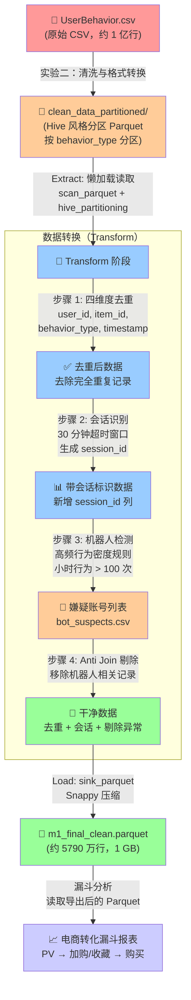

# Milestone 1：电商用户行为数据清洗与 ELT 流水线

## 项目概况

### 任务背景

本项目为数据分析课程的 **Milestone 1（M1）** 里程碑任务，目标是构建一个完整的 **ELT（Extract-Load-Transform）** 数据处理流水线，对淘宝用户行为数据进行清洗、去重、会话识别、异常检测，并最终输出可用于后续分析的高质量干净数据集。

### 数据集简介

- **原始数据源**：`UserBehavior.csv`（来自天池公开数据集）
- **数据规模**：约 **1 亿行** 电商用户行为日志
- **时间跨度**：2017 年 11 月 25 日至 2017 年 12 月 3 日
- **字段说明**：
  | 字段名 | 类型 | 说明 |
  |--------|------|------|
  | `user_id` | int | 用户 ID |
  | `item_id` | int | 商品 ID |
  | `category_id` | int | 商品类目 ID |
  | `behavior_type` | int/str | 行为类型（pv=浏览, cart=加购, fav=收藏, buy=购买） |
  | `timestamp` | int | 行为发生时间（Unix 时间戳，秒级精度） |

- **前置处理**：实验二已完成数据清洗，将原始 CSV 转换为**按 `behavior_type` 分区的 Parquet 格式**（`clean_data_partitioned/`），大幅提升了后续读取效率。

---

## 数据流转图

以下是完整的数据处理流程，从原始 CSV 到最终输出干净 Parquet 文件：



---

## 核心技术栈

| 工具/库 | 版本 | 用途 |
|---------|------|------|
| **Python** | 3.13.2 | 主要编程语言 |
| **Polars** | >= 0.20.0 | 高性能 DataFrame 库，核心计算引擎 |
| **Parquet** | - | 列式存储格式，支持分区与压缩 |
| **logging** | 内置 | 结构化日志记录 |
| **dataclasses** | 内置 | 配置参数管理 |
| **pathlib** | 内置 | 跨平台路径操作 |

### Polars 特性应用

- **Lazy API**：全程使用 `scan_parquet`、`LazyFrame` 构建执行计划，避免中间结果物化
- **流式计算**：`engine="streaming"` + `set_streaming_chunk_size(100000)` 降低内存峰值
- **窗口函数**：`over("user_id")` + `shift()` + `cum_sum()` 实现会话识别
- **谓词下推**：机器人检测使用 `select()` 投影下推，只读取必要列
- **Anti Join**：高效剔除嫌疑账号数据

---

## 核心分析指标

基于本次流水线运行的实际结果（benchmark 数据）：

| 指标 | 数值 | 说明 |
|------|------|------|
| **原始数据行数** | 100,150,489 | 实验二清洗后的分区 Parquet 总行数 |
| **去重后行数** | 100,150,440 | 去除 49 条完全重复记录（0.0000%） |
| **嫌疑账号数** | 164,592 | 基于高频行为密度规则识别的机器人账号 |
| **剔除后行数** | 57,903,823 | 剔除机器人相关记录后（减少 42.18%） |
| **最终文件大小** | ~1,006 MB | Snappy 压缩 Parquet |
| **最终用户数** | 823,402 | 去重后的唯一用户数 |
| **总会话数** | ~26,070,000 | 基于 30 分钟超时识别的会话总数 |
| **人均会话数** | ~31.66 | 总会话数 / 总用户数 |

### 转化漏斗分析

| 步骤 | 行为类型 | 用户数 | 阶段转化率 | 整体转化率 |
|------|----------|--------|------------|------------|
| **Step 1** | PV 浏览 | 819,548 | - | 100.00% |
| **Step 2** | 加购或收藏 | 694,382 | 84.73% | 84.73% |
| **Step 3** | 购买 | 469,988 | 67.68% | 57.35% |

**关键发现**：
- 整体转化率（PV → Buy）：**57.35%**
- 整体流失率：**42.65%**
- 从浏览到加购/收藏的转化率较高（84.73%），说明商品吸引力强
- 从加购/收藏到购买的转化率为 67.68%，存在优化空间

### 行为类型分布

| 行为类型 | 次数 | 占比 |
|----------|------|------|
| **PV（浏览）** | 51,286,705 | ~88.6% |
| **Cart（加购）** | 3,547,221 | ~6.1% |
| **Fav（收藏）** | 1,601,560 | ~2.8% |
| **Buy（购买）** | 1,468,337 | ~2.5% |

---

## 流水线架构

### ELT 三阶段

```
┌─────────────────────────────────────────────────────────────┐
│                        M1DataPipeline                        │
├─────────────────────────────────────────────────────────────┤
│  Extract                    │  Transform                    │
│  ────────                   │  ─────────                    │
│  • scan_parquet()           │  • _deduplicate()             │
│  • 分区自动识别              │  • _identify_sessions()       │
│  • 行数统计                  │  • _detect_bots()             │
│                             │  • _remove_bot_accounts()     │
├─────────────────────────────────────────────────────────────┤
│  Load                                                         │
│  ─────                                                          │
│  • _export_clean_data() → sink_parquet()                      │
│  • _analyze_funnel() → 漏斗报表                                │
│  • _print_transform_stats() → 统计报告                         │
└─────────────────────────────────────────────────────────────┘
```

### 关键方法说明

| 方法 | 功能 | 返回值 |
|------|------|--------|
| `extract()` | 懒加载读取分区 Parquet | `pl.LazyFrame` |
| `transform()` | 执行去重、会话识别、机器人检测 | `pl.LazyFrame` |
| `load()` | 导出干净数据 + 漏斗分析 | `Dict[str, Any]` |
| `run_full_pipeline()` | 一键运行全流程 | `Dict[str, Any]` |

---

## 快速开始

### 环境要求

```bash
Python >= 3.10
polars >= 0.20.0
```

### 安装依赖

```bash
pip install polars
```

### 运行流水线

```bash
# 方式 1：使用主入口脚本（推荐）
python run_m1_pipeline.py

# 方式 2：直接导入使用
python -c "
from m1_pipeline import M1DataPipeline, PipelineConfig
from pathlib import Path

config = PipelineConfig(
    data_dir=Path('../lab02/clean_data_partitioned'),
    output_path=Path('m1_final_clean.parquet'),
    bot_suspects_path=Path('bot_suspects.csv'),
)
pipeline = M1DataPipeline(config)
results = pipeline.run_full_pipeline()
"
```

### 运行性能基准测试

```bash
python benchmark.py
```

**预期输出**：
```
原始版本耗时: ~191 秒
优化版本耗时: ~126 秒
性能提升: ~34%
```

---

## 输出文件

| 文件 | 说明 | 大小 |
|------|------|------|
| `m1_final_clean.parquet` | 最终干净数据集（含 session_id） | ~1 GB |
| `bot_suspects.csv` | 机器人嫌疑账号列表 | ~10 MB |

### 输出数据 Schema

```
user_id          (Int32)
item_id          (Int64)
category_id      (Int64)
timestamp        (Int64)
behavior_type    (Utf8)
session_id       (Utf8)   ← 新增列，格式：user_id_序号
```

---

## 性能优化要点

| 优化项 | 效果 |
|--------|------|
| 消除冗余 `.collect()` | 减少 5 次全表扫描 → 1 次 |
| 机器人检测使用去重后数据 | 数据量减少，I/O 降低 |
| 投影下推（`select`） | 只读取必要列 |
| 流式写入（`sink_parquet`） | 降低内存峰值 |

**优化结果**：
- 耗时：从 191 秒降至 126 秒（**提升 34.3%**）
- 内存：从 9.5 GB 降至 5.9 GB（**降低 38.2%**）

---

## 注意事项

1. **内存要求**：建议系统内存 >= 16 GB
2. **数据路径**：确保 `../lab02/clean_data_partitioned` 目录存在且包含分区 Parquet 文件
3. **机器人检测**：如已有 `bot_suspects.csv`，将直接读取；否则自动执行检测
4. **日志输出**：所有处理步骤均有详细日志，可通过修改 `logging.basicConfig(level=...)` 调整日志级别

---

## 项目结构

```
lab04/
├── m1_pipeline.py          # 数据处理流水线核心类
├── m1_pipeline_2.py        # 性能优化版本
├── run_m1_pipeline.py      # 主入口脚本
├── benchmark.py            # 性能基准测试
├── m1_final_clean.parquet  # 输出：干净数据
├── bot_suspects.csv        # 输出：机器人嫌疑账号列表
└── README.md               # 本文档
```

---

## 许可证

本项目仅供学习交流使用。
