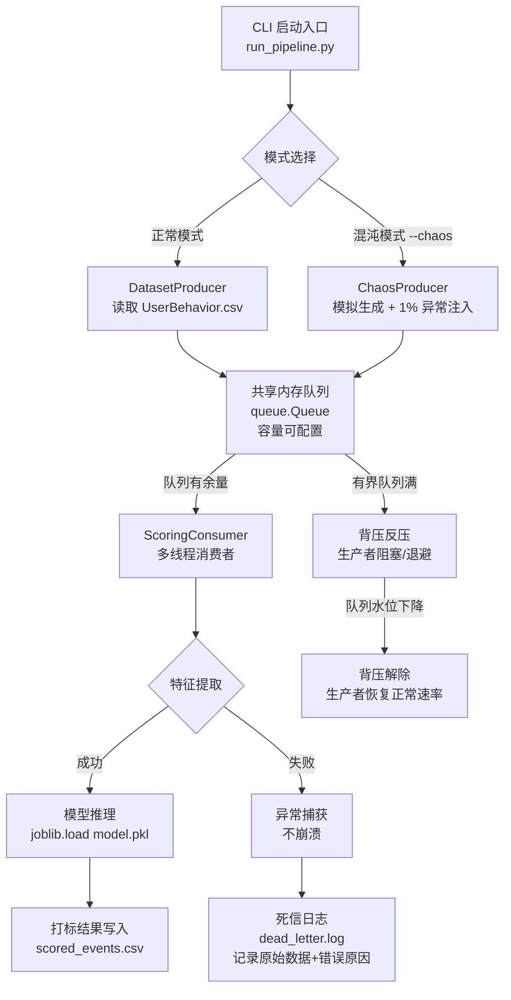

# Milestone 2 (M2) 流批一体数据管道交付文档
> **项目**: 电商用户行为实时打标与容错流处理管道  
> **里程碑**: M2 – 流处理与在线推理  
> **交付日期**: 2026-05-03  
> **作者**: 骆开丹 (9109223091)
---
## 一、项目概况
本项目是课程 Milestone 2 (M2) 的收官交付物。在过去三周（实验五～实验八）中，我们从零构建了一套完整的**流式数据管道**，覆盖以下核心能力：
- **数据模拟产生**：按业务漏斗概率实时生成电商行为日志
- **队列缓存解耦**：基于 `queue.Queue` 实现生产者-消费者异步解耦
- **背压调控**：有界队列 + 高低水位线 + 指数退避，防止系统过载
- **死信降级**：异常数据捕获并写入 `dead_letter.log`，保障进程不崩溃
- **模型推理打标**：加载离线训练的 `model.pkl`，对实时数据进行购买意图预测
- **混沌容错测试**：注入 1% 异常数据 + 超高 QPS 压力测试，验证系统鲁棒性
---
## 二、系统架构图


### 架构说明

|组件|职责|
|---|---|
|**CLI 入口**|通过 argparse 接收 `--qps`、`--queue-limit`、`--duration` 等参数|
|**生产者**|正常模式：流式读取真实 CSV；混沌模式：模拟生成数据并注入字段缺失/类型错误等异常|
|**内存队列**|有界队列（可配置），满时触发背压，生产者阻塞；空时消费者等待|
|**消费者**|在线提取特征（category_id, hour, dayofweek），调用预加载的 sklearn Pipeline 进行购买预测|
|**死信队列**|捕获特征提取/推理异常，将原始数据及错误信息写入 `dead_letter.log`，**进程不中断**|
|**背压机制**|队列满时生产者自动阻塞，实现反压；队列下降后恢复生产，形成自适应调控|

---

## 三、项目文件结构

```text

lab08/
├── run_pipeline.py          # 统一启动入口 (支持正常/混沌模式)
├── model.pkl                # 离线训练的 sklearn Pipeline (joblib 序列化)
├── requirements_m2.txt      # Python 依赖清单
├── README_M2.md             # 本文档
├── scored_events.csv        # 打标结果输出 (正常模式)
├── scored_chaos.csv         # 混沌测试打标结果
├── dead_letter.log          # 死信日志 (异常数据记录)
└── (其他辅助脚本/实验报告)

```
---

## 四、快速启动手册

### 4.1 环境准备
```bash
# 1. 激活虚拟环境
..\lab01\data_env\Scripts\activate
# 2. 安装依赖（如未安装）
pip install -r requirements_m2.txt
# 3. 确认模型文件存在
ls model.pkl
```
### 4.2 正常模式启动（生产级推理管道）
```bash
python run_pipeline.py \
    --qps 20 \
    --queue-limit 200 \
    --duration 30 \
    --dataset "../lab02/UserBehavior.csv" \
    --model "model.pkl" \
    --output "scored_events.csv"
```

|参数|说明|默认值|
|---|---|---|
|`--qps`|生产者速率（条/秒）|20|
|`--queue-limit`|队列最大容量（0=无限）|200|
|`--duration`|实验运行时长（秒）|30|
|`--dataset`|输入 CSV 路径|UserBehavior.csv|
|`--model`|模型文件路径|model.pkl|
|`--output`|打标结果输出 CSV|scored_events.csv|

### 4.3 混沌容错测试启动
```bash
python run_pipeline.py \
    --chaos \
    --dirty-ratio 0.01 \
    --qps 1000 \
    --queue-limit 500 \
    --duration 600 \
    --output "scored_chaos.csv"
```
**同时，在另一终端监控死信日志**：

```powershell
Get-Content dead_letter.log -Wait
```
### 4.4 预期运行效果
- 终端实时打印队列深度、生产者速率、死信计数
- 队列深度在 0～500 之间周期性振荡（背压生效）
- 另一终端持续追加死信记录（异常数据被拦截）
- Python 进程内存稳定，不无限增长
- `scored_chaos.csv` 记录所有打标结果（含失败标记）
- `dead_letter.log` 记录所有异常数据（JSON 格式）

---

## 五、核心技术栈

| 技术           | 用途            | 版本     |
| ------------ | ------------- | ------ |
| Python       | 主语言           | 3.13.2 |
| queue.Queue  | 生产者-消费者解耦     | 内置     |
| threading    | 多线程并发         | 内置     |
| argparse     | CLI 参数解析      | 内置     |
| logging      | 日志输出          | 内置     |
| joblib       | 模型序列化/反序列化    | ≥1.3   |
| scikit-learn | Pipeline 模型推理 | ≥1.3   |
| pandas       | 时间特征解析        | ≥2.0   |
| numpy        | 特征矩阵构造        | ≥1.24  |
## 六、实验验证要点

### 6.1 死信日志样本
```json
{
  "timestamp": "2026-05-02T09:30:15.123456+00:00",
  "error": "invalid literal for int() with base 10: 'not_a_number'",
  "original_data": {
    "user_id": "12345",
    "item_id": "67890",
    "category_id": "not_a_number",
    "behavior_type": "pv",
    "timestamp": "1512000000"
  }
}
```
### 6.2 混沌测试终端截图要点
- **背压触发日志**：`⚠️ 死信 #N: ...` 与 `🐉 已生成 X 条` 交替出现
- **死信持续追加**：`Get-Content dead_letter.log -Wait` 终端持续滚动
- **内存稳定**：任务管理器 Python 进程内存曲线在某一水位波动，无单调递增

---

## 七、AI 协作说明
本 M2 里程碑的工程实现中，AI 编程助手主要贡献了以下环节：
- **CLI 配置化重构**：将散装脚本重构为 `argparse` 统一入口
- **死信降级代码模板**：`try-except` + `write_to_dead_letter()` 模式
- **混沌注入逻辑**：随机生成 `missing_field` / `type_error` / `malformed` 三种异常
- **架构图自动生成**：Mermaid 拓扑图表示数据流与控制流
- **文档排版与补全**：本 README 的格式框架与参数表格
人类负责：业务逻辑验证、参数调优、混沌测试执行、结果分析与报告撰写。


---