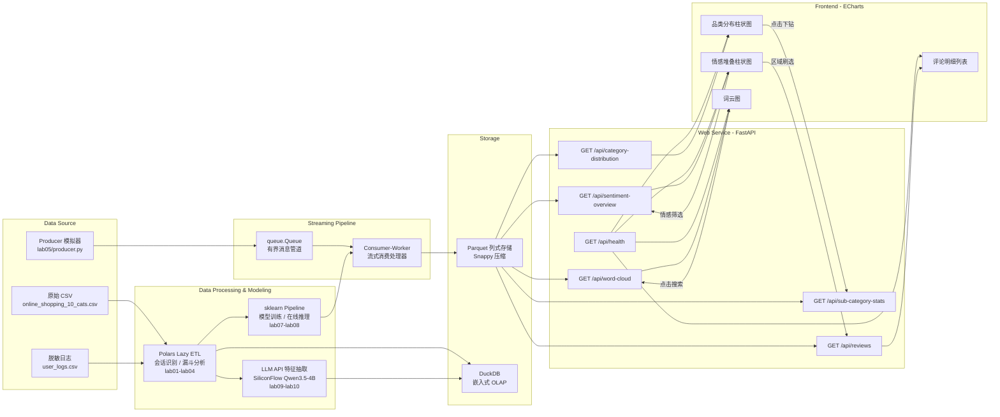

# 大数据分析课程综合实验项目

基于 **轻量级高性能数据栈 + 大语言模型 API** 的高校课程实验交付项目，横跨数据工程全链路——从原始数据清洗、流式批处理、LLM 非结构化特征抽取，到前后端分离的可视化看板。四个里程碑（M1–M4）逐层递进，最终汇聚为一键启动的端到端系统。

---

## 目录

- [项目特色](#项目特色)
- [系统架构与数据流拓扑](#系统架构与数据流拓扑)
- [快速开始与部署指南](#快速开始与部署指南)
- [配置说明](#配置说明)
- [项目目录树](#项目目录树)

---

## 项目特色

### 1. 千万级脱敏日志极速 ETL

基于 **Polars Lazy API 流式处理**，对千万级用户行为日志进行清洗、会话识别、漏斗分析，最终输出 Snappy 压缩的 **Parquet 列式存储**，读取与聚合性能远超传统 Pandas 方案。

### 2. 流式背压管道与 ML/LLM 实时特征预测

采用 **生产者-消费者模式**，以 `queue.Queue` 为有界消息管道，配合背压调控机制实现流量削峰。下游集成 **sklearn Pipeline 在线推理** 完成实时情感打分，并预留 LLM 特征增强入口。

### 3. 高并发大模型调用的容错设计

基于 `asyncio` 异步框架，通过 `Semaphore` 控制并发水位，配合 `tenacity` 指数退避重试策略，实现对 **SiliconFlow 大模型 API（Qwen3.5-4B）** 的稳定高并发调用，完成非结构化评论字段抽取、情感分类、摘要生成等任务。

### 4. 前后端解耦的动态可视化看板

后端基于 **FastAPI** 提供 6 个 RESTful 接口，前端使用 **ECharts** 实现品类分布柱状图、情感堆叠图、词云图、评论明细列表，支持**维度下钻**、**区域刷选**、**正则搜索防抖**等交互，全图表联动刷新。

---

## 系统架构与数据流拓扑



---

## 快速开始与部署指南

### 前置要求

- Python 3.10+
- pip（Python 包管理器）

### 步骤 1：创建虚拟环境

```bash
# 在项目根目录执行
python -m venv .venv
```

激活环境：

```bash
# Windows
.venv\Scripts\activate

# Linux / macOS
source .venv/bin/activate
```

### 步骤 2：安装依赖

```bash
pip install -r lab14/requirements.txt
```

### 步骤 3：一键启动（推荐）

```bash
python lab14/run_app.py
```

脚本会自动完成以下操作：
- 环境自检（检查关键文件、端口占用）
- 启动 Uvicorn 服务（FastAPI 后端）
- 等待服务就绪后自动打开系统默认浏览器
- 按 `Ctrl+C` 优雅停止

### 步骤 4：手动启动（备选）

```bash
# 进入后端目录
cd lab13/dashboard

# 启动 Uvicorn 服务
uvicorn server:app --host 0.0.0.0 --port 8000

# 浏览器手动打开
# http://localhost:8000
```

---

## 配置说明

### LLM API Key

本项目使用 **SiliconFlow** 作为大模型服务提供商，调用模型为 **Qwen3.5-4B**。

环境变量名：`SILICONFLOW_API_KEY`

配置方式（三选一）：

```bash
# 方式一：临时环境变量
# Windows
set SILICONFLOW_API_KEY=your_api_key_here

# Linux / macOS
export SILICONFLOW_API_KEY=your_api_key_here
```

```bash
# 方式二：在项目根目录创建 .env 文件
echo SILICONFLOW_API_KEY=your_api_key_here > .env
```

```bash
# 方式三：在 lab09/ 目录创建 lab09_api_key.env 文件
echo SILICONFLOW_API_KEY=your_api_key_here > lab09/lab09_api_key.env
```

> **降级行为**：未配置 API Key 时，LLM 特征抽取功能自动跳过，后端切换为内置规则库进行情感分析。前端看板顶部将显示降级横幅提示，核心图表功能不受影响。

### 监听端口修改

默认端口为 **8000**。如需修改：

- **方式一**：编辑 `lab14/run_app.py` 中的 `PORT` 变量（第 31 行）
- **方式二**：手动启动时指定端口：
  ```bash
  uvicorn server:app --host 0.0.0.0 --port 8080
  ```

---

## 项目目录树

```
DataAnalysis/
│
├── lab01/                          # M1：原始日志生成与数据清洗
│   ├── generate_large_logs.py      #   千万级脱敏日志生成器
│   ├── clean_pipeline.py           #   Polars Lazy 流式清洗管道
│   └── read_csv_polars.py          #   Polars CSV 读取示例
│
├── lab02/                          # M1：DuckDB OLAP 查询
│   └── *.sql / *.py                #   DuckDB SQL 聚合分析脚本
│
├── lab03/                          # M1：会话识别与漏斗分析
│   ├── session_identification.py   #   用户会话切割与特征提取
│   ├── conversion_funnel.py        #   转化漏斗各阶段统计
│   ├── bot_detection.py            #   爬虫/机器人流量检测
│   └── dedup_partitioned_parquet.py #  Parquet 分区去重
│
├── lab04/                          # M1：ELT 管道工程化封装
│   ├── m1_pipeline.py              #   Polars ETL 管道主程序
│   ├── m1_pipeline_2.py            #   扩展 Pipeline 版本
│   ├── run_m1_pipeline.py          #   Pipeline 执行入口
│   └── benchmark.py                #   性能基准测试
│
├── lab05/                          # M2：流式管道基础——生产者-消费者
│   ├── producer.py                 #   数据模拟器（生产者）
│   └── observer.py                 #   流式监控观察者
│
├── lab06/                          # M2：背压实验与流式预处理
│   ├── task1_platform.py           #   流处理平台基础框架
│   ├── task2_baseline_experiments.py # 基线吞吐实验
│   ├── task3_perturbation_experiment.py # 扰动注入实验
│   └── task4_stream_preprocess.py  #   流式数据预处理
│
├── lab07/                          # M2：ML 模型训练与在线推理
│   ├── train_model.py              #   情感分类模型训练（sklearn）
│   ├── task2_model_loading.py      #   模型序列化加载
│   ├── task3_end_to_end_scoring.py #   端到端在线打分
│   └── task4_micro_batch.py        #   微批次流式推理
│
├── lab08/                          # M2：流批一体 Pipeline 集成
│   └── run_pipeline.py             #   完整流处理入口（Producer → ML）
│
├── lab09/                          # M3：LLM 非结构化特征抽取
│   ├── task2_connectivity_test.py  #   大模型 API 连通性测试
│   ├── task3_structured_extraction.py # 结构化字段抽取
│   ├── task4_batch_processing.py   #   批量特征抽取
│   ├── task5_data_pipeline.py      #   数据管道集成
│   ├── task6_model_ab_test.py      #   AB 测试对比实验
│   └── lab09_api_key.env           #   API Key 配置文件（示例）
│
├── lab10/                          # M3：高并发 LLM 调用与重试
│   ├── task1_async_client.py       #   asyncio 异步客户端
│   ├── task2_semaphore_concurrency.py # Semaphore 并发控制
│   ├── task3_tenacity_retry.py     #   指数退避重试
│   └── task4_1000_batch_process.py #   千级批量处理管道
│
├── lab11/                          # M3：可解释性分析与消融实验
│   ├── task1_tfidf_baseline.py     #   TF-IDF 基线模型
│   ├── task2_sparse_dense_fusion.py # 稀疏-稠密特征融合
│   ├── task3_ablation_study.py     #   消融实验
│   └── task4_shap_analysis.py      #   SHAP 模型解释
│
├── lab12/dashboard/                # M4：数据看板后端（演进版本）
│   └── server.py                   #   FastAPI 服务端
│
├── lab13/dashboard/                # M4：数据看板前后端（正式版）
│   ├── server.py                   #   FastAPI 服务端（6 个 API）
│   └── frontend/
│       └── index.html              #   ECharts 交互看板前端
│
├── lab14/                          # 系统联调与工程规范
│   ├── run_app.py                  #   一键启动脚本
│   ├── requirements.txt            #   最小依赖清单
│   └── README.md                   #   本文档
│
├── H_M/                            # H&M 推荐系统独立项目
│   ├── step1_load_data.py          #   数据加载
│   ├── step2_features.py           #   特征工程
│   ├── step3_baseline.py           #   基线模型
│   ├── step4_candidates.py         #   候选集生成
│   ├── step5_train.py              #   模型训练
│   ├── step6_submit.py             #   提交与评估
│   ├── config.py                   #   配置文件
│   └── utils.py                    #   工具函数
│
├── .venv/                          # Python 虚拟环境
└── lab14/requirements.txt          # 项目级依赖清单
```
